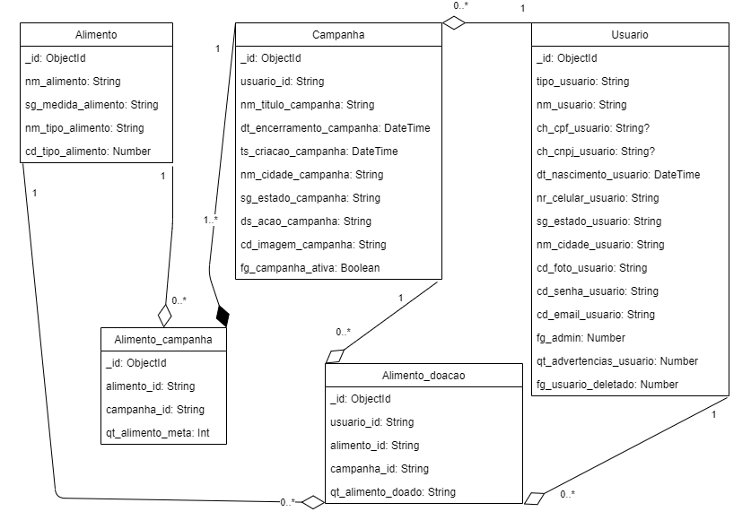

# DSM-G07-PI3-2024-2
Repositório do GRUPO 07 do Projeto Interdisciplinar do 3º semestre DSM 2024/2. Alunos: Eduardo Gibertoni Camilo, Frederico Pessoa Barbosa, Jorge Luiz Patrocínio dos Santos, Rafael Victor Redoval de Sousa, Yago Raphael de Melo Mouro.

# Nação Nutrida

Projeto interdisciplinar DSM 2° SEMESTRE 2024 
Faculdade: Dr. Thomaz Novelino (Fatec Franca) 

Nosso projeto tem um propósito especial: arrecadar alimentos para doação. Através de doações virtuais, os usuários podem contribuir com alimentos básicos que serão entregues a quem mais precisa.

## 🚀 Iniciando

Bem-vindo ao Nação Nutrida! Este projeto tem como objetivo arrecadar alimentos para doação através de doações virtuais. Estamos ansiosos para que você contribua para este projeto e ajude a fazer uma diferença na vida das pessoas.

### 📋 Pré-requisitos

```
Node.js >=  a versão 14.17.0
npm >= a versão 6.14.13
```

### 🔧 Instalação

1. Instale as dependências do projeto:
```
npm install
```

2. Execute o script para configurar o banco de dados:
  * cd database
  * node popularBanco.js

## Executando o projeto

Front-End:
1. Na pasta raiz do projeto, execute:
```
npm run start
```

Back-End: 
1. É necessário entrar na pasta '/server' e rodar o script
2. Execute o servidor:
```
npm run dev
```

## 🛠️ Tecnologias Utilizadas

* [Typescript](https://www.typescriptlang.org/)
* [React](https://react.dev/)
* [MongoDB](https://www.youtube.com/watch?v=fmerTu7dWk8)


## 📌 Versão

Versão atual 0.0.3

## Modelagem Conceitual


## Diagrama NoAM



## ✒️ Autores

* **Yago Mouro** - (https://github.com/yagomouro)
* **Leonardo Victor** - (https://github.com/Leovpf)
* **Rafael Victor** - (https://github.com/rafaelVictor05)
* **Jorge Patrocinio** - (https://github.com/jorgesantos001)
* **Eduardo Gibertoni** - (https://github.com/EduardoGibertoniCamillo)


## 🎁 Agradecimentos

Gostaríamos de expressar nossa gratidão a todos os colegas e participantes do projeto pelo empenho, dedicação e colaboração ao longo do desenvolvimento do "Nação Nutrida". Cada um contribuiu de maneira única e indispensável para o sucesso do projeto.

Encorajamos todos a compartilhar este projeto com outras pessoas. Nossa jornada não apenas fortaleceu nossas habilidades profissionais, mas também nos aproximou como equipe. Vamos inspirar outros com o que alcançamos juntos!

---
❤️😊
